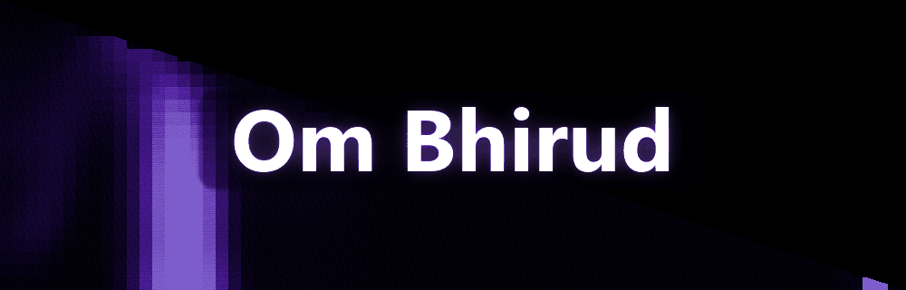

  

## Hey there 👋

I build AI systems that feel effortless — voice-first interfaces, retrieval-augmented generation, and real-time data platforms. I care about answers that are **grounded in evidence**, interfaces that respond in **any language you speak**, and code that ships.

---

### ⚡ Featured Projects

### 🎙️ [AWAAZ — Voice-Enabled Multilingual RAG](https://github.com/UniqCoder/AWAZ-voice-enabled-rag-model)

A production-grade, voice-first RAG system: ask a question by voice or text in **Hindi, Tamil, Bengali or English** — get a grounded answer in the language you choose, with sources and confidence scoring.

- 🔀 **Hybrid retrieval** — dense multilingual embeddings + BM25, fused with Reciprocal Rank Fusion
- 🛡️ **Anti-hallucination guardrails** — groundedness validation and honest general-knowledge fallback labeling
- 🌐 **Full multilingual loop** — Unicode-script language detection, per-language response selection, ~500ms answers

 

### 🧭 [PathPilot](https://github.com/UniqCoder/PathPilot)

A companion that helps students navigate their growth — built with a clean, modern TypeScript stack.

---

  
  

